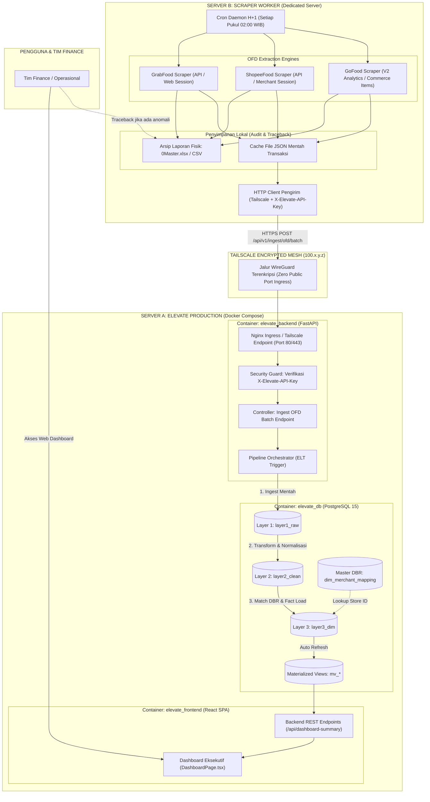
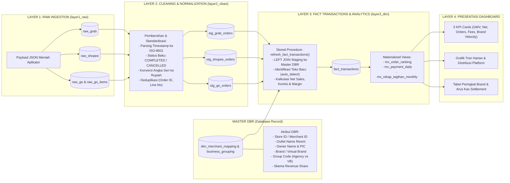
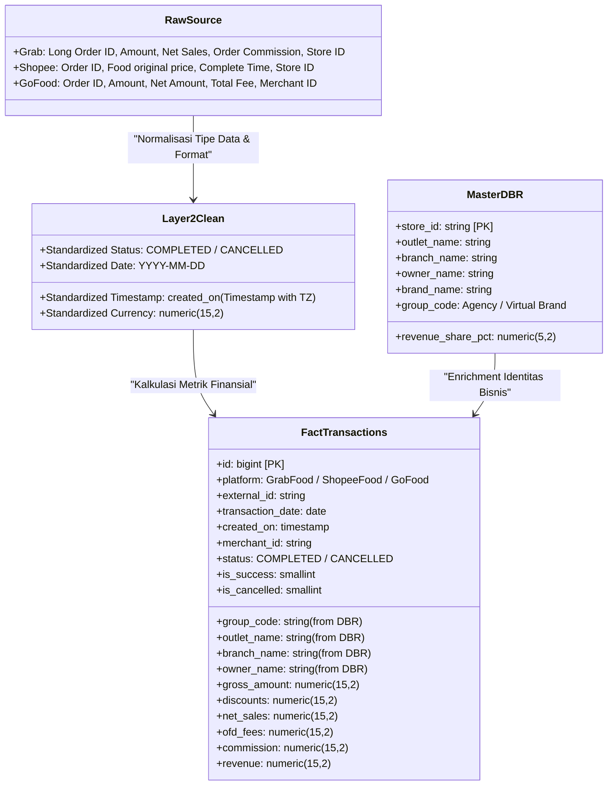
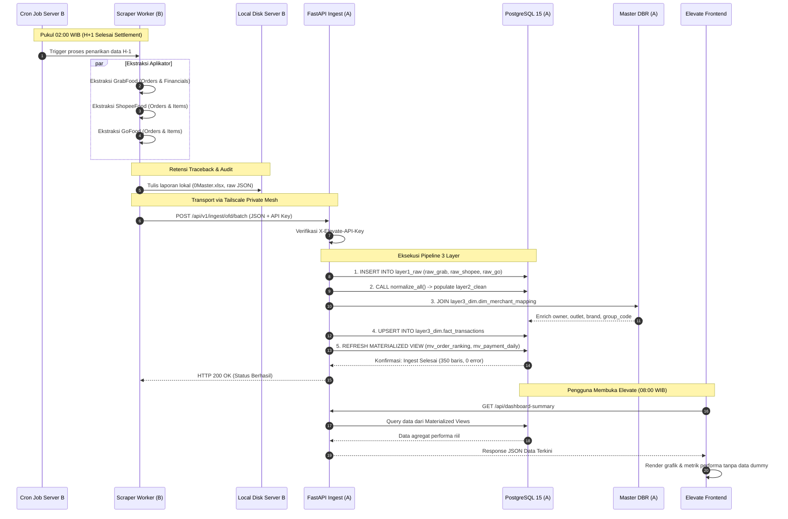

# Arsitektur Pipeline Multi-Server & Pemetaan 3 Layer Data OFD

Dokumen ini memuat diagram Mermaid komprehensif yang memetakan topologi multi-server, alur pemrosesan 3 layer data, integrasi Master DBR (Database Record), serta siklus eksekusi cron job harian H+1. Dokumen ini dirancang agar mudah dipahami oleh tim teknis, tim data, maupun pemangku kepentingan (*stakeholders*).

---

## 1. Topologi Jaringan & Pemisahan Server (Tailscale Mesh)

Diagram ini mengilustrasikan pemisahan fisik antara Server Scraper (Server B) dan Server Elevate (Server A) menggunakan jaringan terenkripsi Tailscale Mesh, memastikan port PostgreSQL tidak pernah terekspos ke internet publik.

---

## 2. Alur Pemrosesan Data 3 Layer & Pencocokan Master DBR

Diagram alur berikut menjelaskan transformasi dari payload mentah aplikator hingga menjadi data analitik siap saji di dashboard:

---

## 3. Matriks Pemetaan Kolom (*Column Lineage Mapping*)

Tabel dan diagram di bawah ini merinci pemetaan atribut dari data mentah ketiga aplikator, transformasi pembersihannya, hingga kolom pada tabel fakta utama `layer3_dim.fact_transactions`:

---

## 4. Diagram Urutan Eksekusi Cron Job H+1 (*Chronological Sequence*)

Diagram interaksi urutan proses dari mulai cron job aktif di Server B hingga dashboard terbarui di Server A:

---

## 5. Ringkasan Manfaat Arsitektur Ini untuk Presentasi

1. **Keamanan Maksimal**:
   - Port database 5432 tidak dibuka ke internet, hanya diakses oleh aplikasi lokal dan jaringan privat Tailscale.
   - Endpoint dilindungi token rahasia berkekuatan tinggi (`X-Elevate-API-Key`).
2. **Ketahanan Sistem (*High Availability*)**:
   - Jika proses scraping mengalami lonjakan beban atau memori, server aplikasi dan database Elevate tetap beroperasi normal tanpa gangguan.
3. **Traceback Finansial Ganda**:
   - Format JSON digunakan untuk kecepatan pemrosesan otomatis ke database dan visualisasi dashboard.
   - Format Excel/CSV tetap disimpan di server scraper sebagai arsip bukti audit manual jika tim finance membutuhkan rekonsiliasi per transaksi.
4. **Otomatisasi Penuh**:
   - Seluruh rantai dari Layer 1 (Raw) hingga pembaruan Materialized View berjalan otomatis dalam satu alur terkoordinasi setelah data diunggah oleh cron job.
