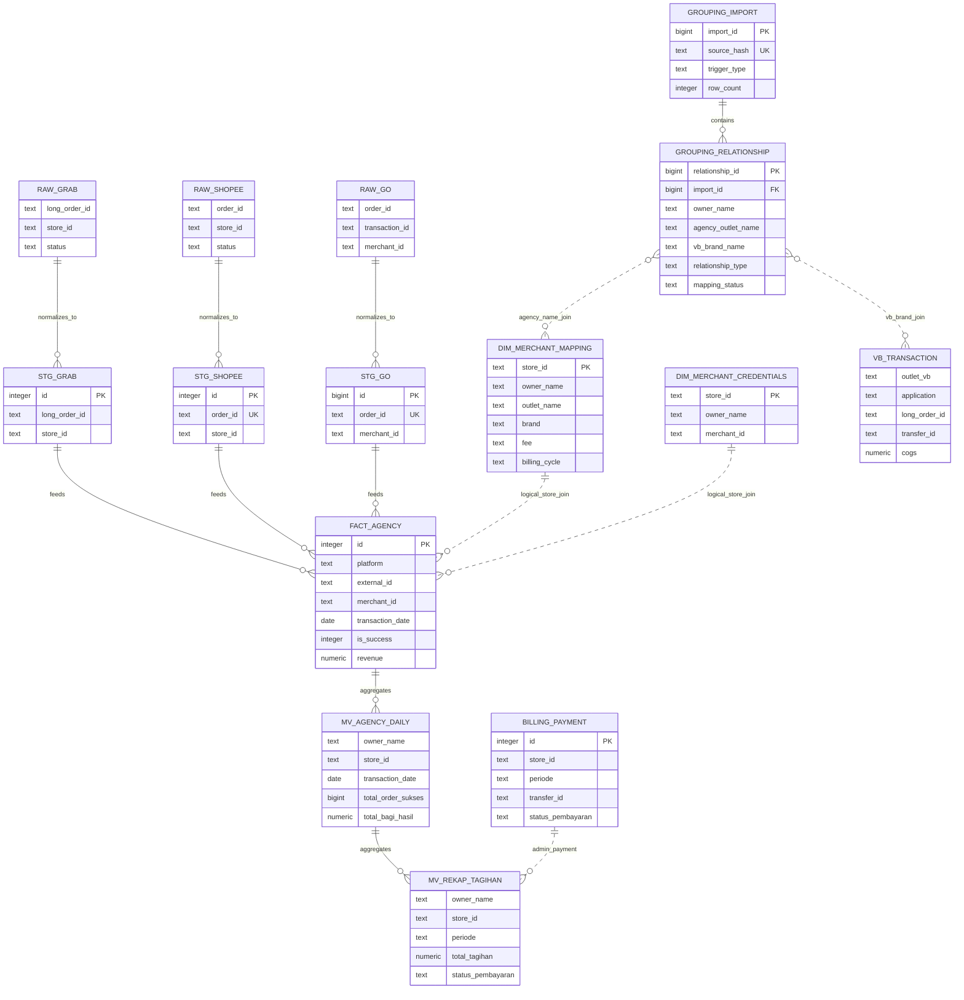

# Current Database ERD

**Snapshot:** 7 September 2026  
**Source:** PostgreSQL database aktual FoodMaster/Elevate  
**Scope:** Agency pipeline, approved Agency/VB grouping, dan billing saat ini

Garis putus-putus pada ERD berarti hubungan bisnis/logis yang dilakukan melalui JOIN, tetapi belum ditegakkan sebagai foreign key.

## ERD



## Layer map

```text
layer1_raw
  raw_go, raw_grab, raw_shopee

layer2_clean
  stg_go_orders, stg_grab_orders, stg_shopee_orders

layer3_dim
  dim_merchant_mapping
  dim_merchant_credentials
  fact_transactions
  business_grouping_imports
  business_grouping_relationships
  billing_payments
  materialized views dan reporting views
```

## Findings

### 1. Ada dua canonical fact yang berbeda

Database aktual memiliki:

```text
public.fact_transactions
layer3_dim.fact_transactions
```

Code utama dan materialized view menggunakan layer3_dim.fact_transactions, tetapi beberapa endpoint masih merujuk public.fact_transactions. Ini berisiko membuat API dan dashboard membaca dataset berbeda.

Rekomendasi: tetapkan layer3_dim.fact_transactions sebagai canonical Agency fact dan hapus ketergantungan query terhadap tabel public.

### 2. Merchant mapping belum memiliki foreign key

Kolom fact_transactions.merchant_id secara bisnis merujuk ke dim_merchant_mapping.store_id, tetapi belum ada foreign key. Relasinya masih berupa JOIN logis.

Sebelum menambah foreign key, audit dahulu transaksi yang tidak memiliki master merchant.

### 3. Grouping sudah memiliki histori import

Relationship grouping memiliki FK ke business_grouping_imports dan view aktif:

```text
business_grouping_imports
→ business_grouping_relationships
→ v_current_business_grouping
```

Relasi ke Agency dan VB masih berbasis nama. Ini sesuai keputusan bahwa spreadsheet adalah hasil grouping manual, tetapi nama tersebut harus divalidasi sebelum settlement.

Untuk Agency settlement, relasi grouping yang aktif diperlakukan sebagai berikut:

- `AGENCY_ONLY` masuk laporan Agency;
- `HYBRID` juga masuk laporan Agency;
- `VB_ONLY` tidak masuk laporan Agency;
- outlet aktif yang belum memiliki baris grouping diperlakukan sebagai Agency langsung sampai ada hasil grouping yang mengklasifikasikannya berbeda.

Jika satu owner/outlet memiliki beberapa baris grouping, `HYBRID` diprioritaskan sebagai klasifikasi bisnis.

### 4. Billing payment masih Agency-oriented

billing_payments memakai key store_id + periode, sehingga belum cocok untuk payable VB yang berbasis COGS dan brand VB. Sebaiknya payment Agency dan VB tetap terpisah sampai kedua settlement model stabil.

### 5. VB transaction belum ada

Database belum memiliki raw, staging, fact, maupun recap table untuk VB. Entitas VB_TRANSACTION pada ERD adalah target Phase 3, bukan tabel aktual.

### 6. Lineage raw ke staging belum formal

fact_transactions.raw_record_id belum membedakan sumber tabel staging. Untuk audit yang lebih aman, tambahkan metadata:

\`\`\`text
source_platform
source_table
source_record_id
\`\`\`

### 7. Credential berada di reporting schema

Tabel credential masih menyimpan password di database. Ini bukan blocker ERD, tetapi perlu dipisahkan dari schema reporting dan dikelola dengan secret storage.

## Prioritas perbaikan

1. Tetapkan satu canonical fact_transactions.
2. Audit referensi public.fact_transactions.
3. Audit orphan merchant mapping.
4. Validasi grouping terhadap Agency master dan VB source.
5. Implementasi tabel VB transaction dan COGS recap.
6. Satukan hasil Agency dan VB di level Owner dan periode settlement.
