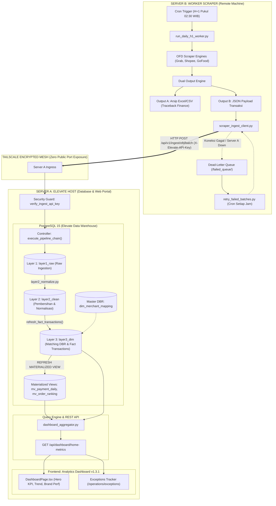

# Panduan Implementasi Komprehensif: Fase 1, Fase 2, dan Fase 3 Pipeline Data Elevate

Dokumen ini adalah panduan arsitektur dan operasional menyeluruh untuk integrasi pipeline data transaksi Online Food Delivery (OFD: GrabFood, ShopeeFood, dan GoFood) ke sistem **Elevate Analytics Dashboard**.

---

## 1. Ikhtisar Arsitektur Multi-Server (3 Layer Data)

Sistem mengadopsi arsitektur terdistribusi yang memisahkan beban *scraping* (komputasi intensif) dari beban *serving* dashboard (analitik latensi rendah) menggunakan jaringan privat **Tailscale Mesh**.



---

## 2. Fase 1: Fondasi API Keamanan, Ingesti Batch, dan Eksekusi 3-Layer (Selesai)

### Sasaran & Deliverables
1. **API Security Guard (`backend/core/api_security.py`)**:
   - Validasi header `X-Elevate-API-Key` dengan perbandingan *constant-time* (`hmac.compare_digest`) guna mencegah serangan *timing attack*.
   - Filter subnet IP tepercaya (mendukung rentang Tailscale CGNAT `100.64.0.0/10` dan loopback `127.0.0.1`).
2. **Orkestrator Pemrosesan 3-Layer (`backend/core/batch_ingest.py`)**:
   - **Layer 1 (Raw Ingestion)**: Menyimpan baris mentah transaksi ke tabel staging `layer1_raw.stg_grab_raw`, `stg_shopee_raw`, `stg_go_orders`, dan `stg_go_items`.
   - **Layer 2 (Pembersihan Data)**: Menjalankan pembersihan tipe data, penyeragaman timestamp WIB, pemisahan komponen diskon, dan normalisasi status order.
   - **Layer 3 (Pencocokan Master DBR & Fakta Transaksi)**: Menghubungkan transaksi ke `layer3_dim.dim_merchant_mapping` berdasarkan Store ID / Merchant ID aplikator, memperbarui `fact_transactions`, dan menyegarkan (*refresh*) seluruh *materialized views*.
3. **Endpoint REST API Ingesti (`backend/server.py`)**:
   - `POST /api/v1/ingest/ofd/batch`: Menerima payload JSON berkecepatan tinggi.
   - `POST /api/v1/ingest/ofd/upload`: Menerima unggahan file Excel/CSV mentah multipart.
   - `GET /api/v1/ingest/status`: Pemeriksaan status koneksi dan ringkasan baris data per layer.
4. **Klien Pengirim Tailscale (`scripts/scraper_ingest_client.py`)**:
   - Skrip klien mandiri berbasis pustaka standar Python (`urllib.request`) tanpa ketergantungan library berat, dilengkapi mekanisme *exponential backoff retry*.

---

## 3. Fase 2: Otomatisasi & Ketahanan Worker Scraper H+1 di Server B

### A. Sasaran Teknis
- Server B beroperasi 100% otonom via cron job harian pada pukul 02:30 WIB untuk menarik transaksi hari kemarin (H-1).
- Menyimpan arsip fisik Excel/CSV lokal (*Output A*) sebagai jaminan jejak audit (*traceback*) tim finance.
- Mengirimkan data transaksi dalam bentuk JSON terstruktur (*Output B*) ke Server A via Tailscale.
- Memiliki *Dead-Letter Queue (DLQ)* lokal sehingga data transaksi tidak akan hilang bila koneksi internet terputus atau Server A sedang dalam masa pemeliharaan.

### B. Komponen Utama Server B
1. **Orkestrator H+1 (`scripts/run_daily_h1_worker.py`)**:
   - Menghitung rentang tanggal H-1 otomatis (`target_date = date.today() - timedelta(days=1)`).
   - Menjalankan scraping GrabFood, ShopeeFood, dan GoFood dalam subproses terisolasi.
   - Menyimpan output file Excel ke `/data/archive_ofd/{platform}/{YYYY}/{MM}/{platform}_master_{YYYY-MM-DD}.xlsx`.
   - Mengonversi data ke skema JSON dan mengirimkannya ke Server A via Tailscale.
2. **Cron Pemulih Antrean Kegagalan (`scripts/retry_failed_batches.py`)**:
   - Berjalan setiap jam melalui cron daemon.
   - Memeriksa direktori `/data/failed_queue/`. Jika ada batch yang gagal terkirim sebelumnya, skrip akan mencoba mengirimkannya ulang. Setelah berhasil, file dipindahkan ke `/data/failed_queue/processed/`.
3. **Monitoring & Webhook Notifikasi**:
   - Mengirimkan ringkasan status harian ke webhook Discord / Telegram (atau log lokal) mencakup: status scraping per aplikator, total baris transaksi yang berhasil diarsip dan dikirim, serta durasi total eksekusi.

### C. Konfigurasi Cron Daemon di Server B
```bash
# Buka crontab di Server B
crontab -e

# Eksekusi scraping H+1 setiap hari pukul 02:30 WIB
30 2 * * * cd /home/worker/elevate && /home/worker/venv/bin/python3 scripts/run_daily_h1_worker.py >> /var/log/elevate_worker.log 2>&1

# Eksekusi retry dead-letter queue setiap 1 jam
0 * * * * cd /home/worker/elevate && /home/worker/venv/bin/python3 scripts/retry_failed_batches.py >> /var/log/elevate_retry.log 2>&1
```

---

## 4. Fase 3: Integrasi Data Riil ke Analytics Dashboard di Server A

### A. Sasaran Teknis
- Mengganti seluruh data prototipe statis (*mock data*) pada `frontend/src/pages/DashboardPage.tsx` menjadi data transaksi aktual dari PostgreSQL Layer 3.
- Menyediakan endpoint agregasi SQL berkecepatan tinggi (`< 250ms`) yang langsung menyajikan seluruh metrik dashboard dalam satu panggilan API.
- Menjamin kepatuhan standar UX *Anti-Slop*: skeleton loading tanpa pergeseran layout (*zero cumulative layout shift*), format angka rupiah yang ramah dibaca (*human-readable*), dan penanganan *empty state* yang informatif.

### B. Arsitektur Agregasi Backend (`backend/core/dashboard_aggregator.py`)
Mengeksekusi kueri terpadu ke PostgreSQL:
1. **5 Hero KPI Cards**:
   - **Total GMV (Gross Merchandise Value)**: Akumulasi nilai kotor pesanan.
   - **Net Payout / Revenue**: Dana bersih setelah potongan komisi platform dan diskon.
   - **Total Volume Pesanan**: Jumlah transaksi sukses vs batal.
   - **Active Outlets**: Jumlah cabang resto fisik yang membukukan order pada periode tersebut.
   - **Average Order Value (AOV)**: Nilai rata-rata keranjang per pesanan.
2. **Tren Kecepatan Harian (Senin s/d Minggu)**:
   - Menghitung kurva tren order harian selama 7 hari berdasarkan aturan kalender *First Monday Rule*.
   - Memisahkan kontribusi pesanan antara Merchant Agency dan Virtual Brand.
3. **Distribusi Brand & Top 5 Performa**:
   - Peringkat 5 brand terlaris dengan pangsa pasar dan nominal GMV dari `layer3_dim.mv_order_ranking`.
4. **Likuiditas Settlement & Hak Tagih**:
   - Perhitungan hak tagih biaya jasa pengelolaan Elevate vs kewajiban transfer ke mitra dari `layer3_dim.v_agency_settlement_report`.

### C. Endpoint REST API Baru (`backend/server.py`)
```http
GET /api/dashboard/home-metrics?year=2026&month=5&week=1&owner=All&business=All
X-Elevate-API-Key: elevate_internal_tailscale_secret_key_2026
```

### D. Penyelarasan Frontend (`DashboardPage.tsx` & `api.ts`)
- Memanggil `fetchHomeDashboardMetrics()` saat komponen dimuat atau saat operator mengubah filter Tahun, Bulan, Minggu, Owner, atau Model Bisnis.
- Menampilkan skeleton shimmer saat mengambil data baru.
- Menampilkan pesan panduan bila rentang tanggal yang dipilih belum memiliki data hasil scraping.

---

## 5. Ringkasan Matriks Peran & Tanggung Jawab

| Dimensi | Server B (Worker Scraper) | Server A (Host Elevate & Dashboard) |
|---|---|---|
| **Peran Utama** | Penarikan data mentah H+1 (EL) | Pembersihan, Transformasi, Penyimpanan, Analitik (T + Serving) |
| **Beban Kerja** | Headless Chrome, Browser Automation | FastAPI Server, PostgreSQL DW, React SPA |
| **Output Data** | Arsip Excel lokal + Payload JSON | Layer 1 (Raw), Layer 2 (Clean), Layer 3 (Dim/Facts) |
| **Keamanan** | Klien Tailscale Mesh, API Key Auth | Server Tailscale Mesh, Guard Middleware, DB terisolasi |
| **Penanganan Error** | Dead-Letter Queue lokal + Hourly Retry | Database Transaction Rollback, Staging Logging |
